## Стенд @pk8.mskobr по специальности 09.02.06 Сетевое и системное администрирование на 2024-2025 год

Базовый стенд представлен по сссылке - https://disk.yandex.ru/d/Qfry02DM_LYcGA (вложенный ахрив, открывать через 7-ZIP) (Стенд для добавления в VMware Player, вложенная виртуализация через ESXi). (в стенде могут быть изменения)

Для установки стенда через скрипт PVE (https://disk.yandex.ru/d/uT7Z3o0uaSBpjg), инструкция тут - https://itsliventsev.yonote.ru/share/548e46da-9cc5-41a8-9f77-0d4c7134ca73/doc/skript-dlya-avtorazvertyvaniya-stenda-de-2025-adm-na-pve-DT85xpRqXT

# Модуль 1 "Настройка сетевой инфраструктуры"

## Вводная информация по модулю 1

#### Топология сети

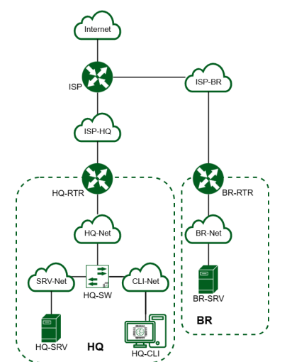

### Требования к ресурсам и гостевым ОС

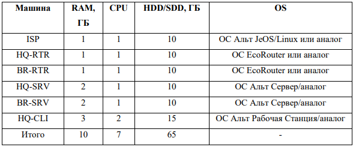

### Таблица имен

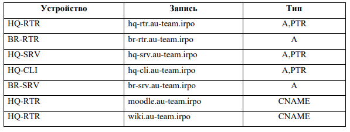

## 1. Произведите базовую настройку устройств

Для базовой настройки ОС необходимо выдать имя хоста (hostname), IP-адреса на ВСЕ сетевые адаптеры, произвести обновление репозиториев, установить необходимые пакеты. (в задании указано IP-адрес должен быть из приватного диапазона, в случае, если сеть локальная, согласно RFC1918*)

### Выдача имени хоста (hostname)

Пишем полное имя хоста - hq-rtr.au-team.irpo

mcedit /etc/hostname

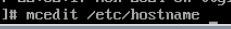

Изменяем данные в файле на имя машины по заданию

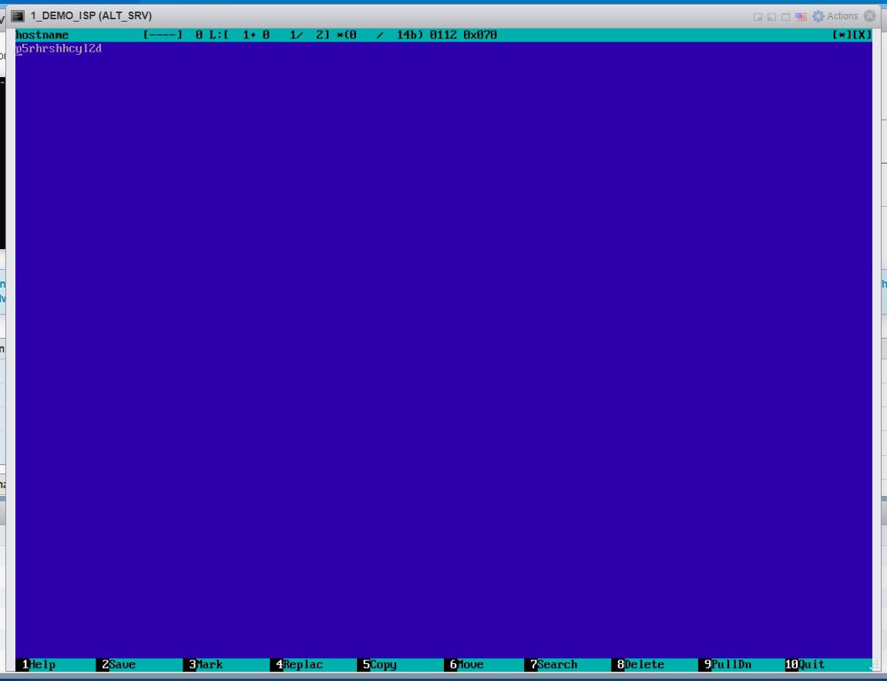

Сохраняем данные (Esc)


###  Используйте полное доменное имя

domainname au-team.irpo


*Имена хостов и т.п.


-------------------

### Настройка IP-адресов

Для проверки виртуальных сетевых адаптеров прописываем на ВМ команду - ip -c a

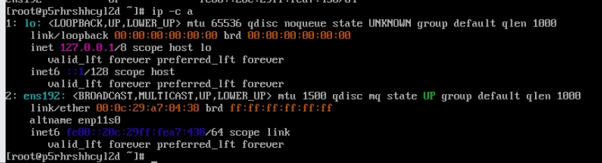

Если на ВМ не хватает сетевых адаптеров по схеме, то добавляем новые в настройках ВМ.

Правой кнопкой по окну ВМ или в списке ВМ и открываем Edit Setings

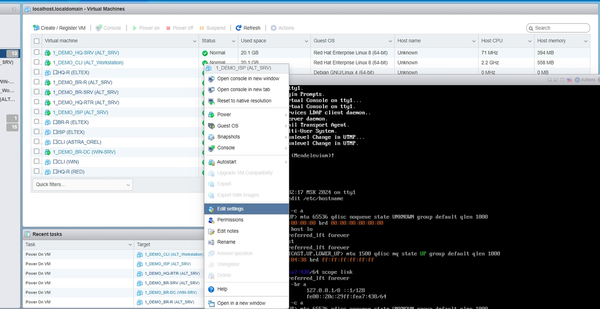

В меню выбираем Add network adapter

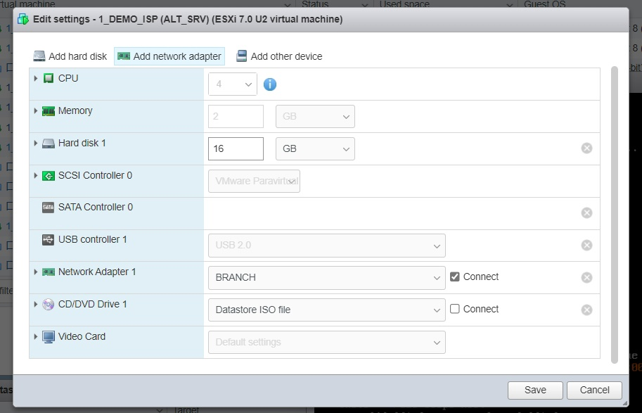

Далее проставляем сети в соответствии с заданием (схемой сети)

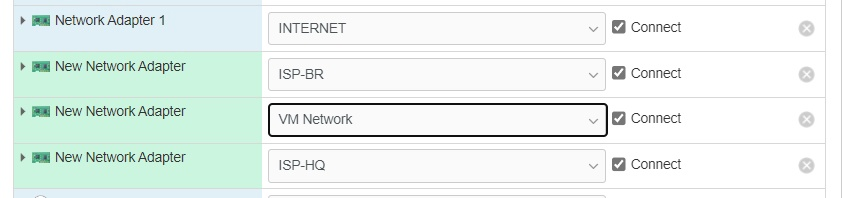

### Настройка DNS в сетевых адаптерах

*делаем настройку на всех машинах кроме ISP


#### Корректные сетевые адаптеры для ISP

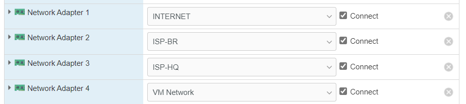

#### Корректные сетевые адаптеры для BR-RTR

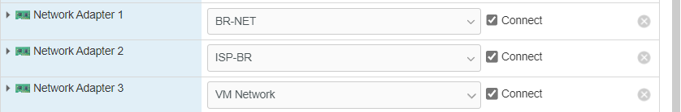

#### Корректные сетевые адаптеры для BR-SRV

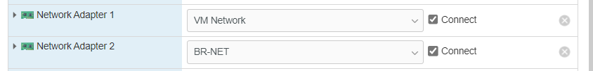

#### Корректные сетевые адаптеры для CLI

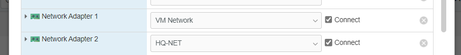

#### Корректные сетевые адаптеры для HQ-RTR

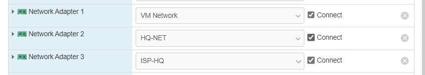

#### Корректные сетевые адаптеры для BR-DC

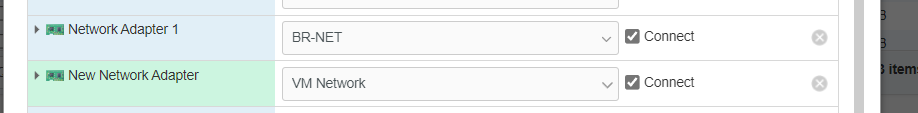

#### Корректные сетевые адаптеры для HQ-SRV

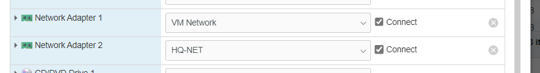

--------------------

*RFC1918 - меморандум Internet Engineering Task Force (IETF) о методах назначения частных IP-адресов в сетях TCP/IP.

| Блок адресов      | Макс.            |  Префиксы           |
| :-----------------| :--------:       | :-------------:     | 
| 10.0.0.0          | 10.255.255.255   | 10/8 prefix         | 
| 172.16.0.0        | 172.31.255.255   | 172.16/12 prefix    | 
| 192.168.0.0       | 192.168.255.255  | 192.168/16 prefix   |


#### Пример варианта IP-адресации (лучше также сделать в отдельно файлике у себя, чтобы не путаться)


#### Постановка адресации на ВМ без графического интерфейса

Создаем директории для новых адаптеров, по названию адаптеров*

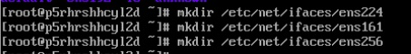

*названия адаптеров смотрим в ip -c a

**Директория для ens192 уже пресоздана на всех машинках

Копируем файл конфигурации сетевого адаптера ИЗ ENS192 в каждую директорию сетевого адаптера

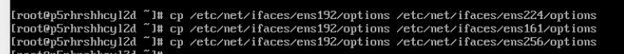

#### Выдача IP-адреса по DHCP

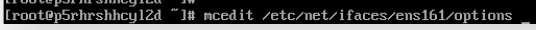

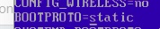

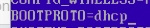

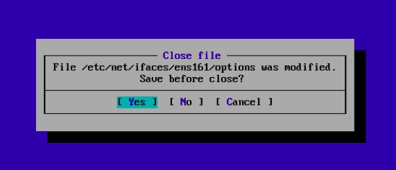

#### Выдача статических адресов

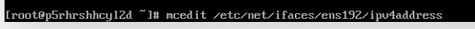

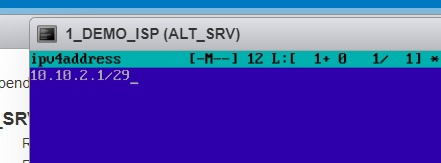

#### Настройка основного шлюза для статики (НА ВСЕХ УСТРОЙСТВАХ - BR-RTR, HQ-RTR на ISP, сеть HQ - на HR-RTR, сеть BR - на BR-RTR


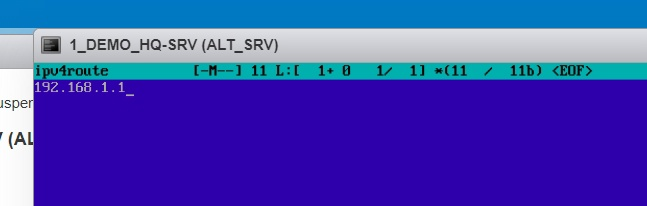

Чтобы обновить данные - перезапускаем сервис сети

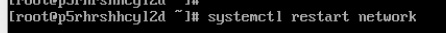

Видим по итогу, что сетевые адаптеры обновились и выдались адреса


Для примеения имени хоста - перезагружаем ВМ

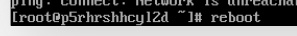

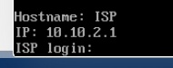

-------------------

#### Пример настройки для HQ-SRV

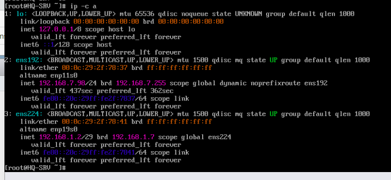

#### Пример настройки для BR-SRV

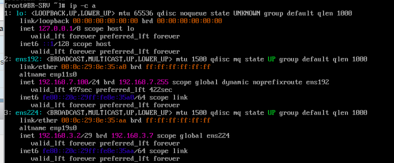

#### Пример настройки для HQ-RTR

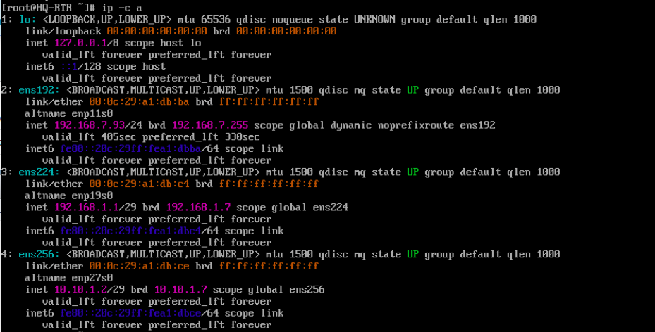

#### Пример настройки для CLI

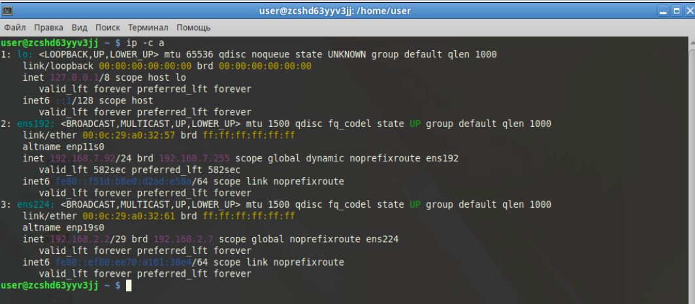

#### Пример настройки для BR-R

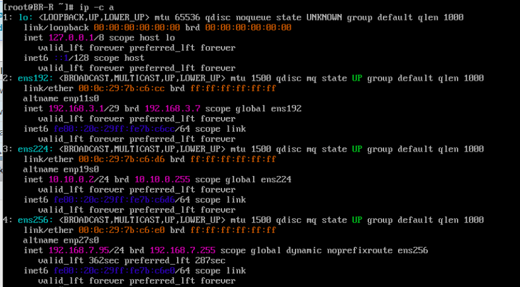


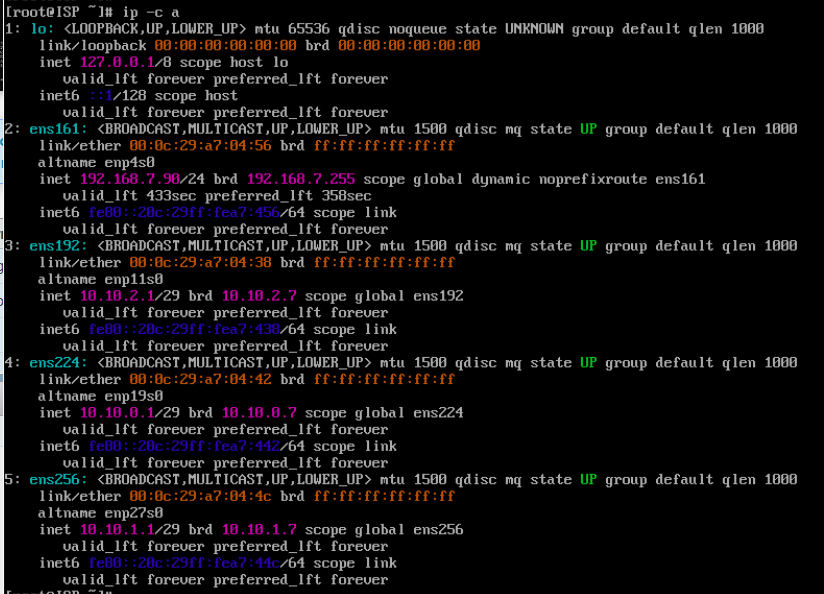

--------------------

## 2. Настройка ISP

Настройте адресацию на интерфейсах: Интерфейс, подключенный к магистральному провайдеру, 
получает адрес по DHCP Настройте маршруты по умолчанию там, где это необходимо Интерфейс, к которому подключен HQ-RTR, подключен к сети 
172.16.4.0/28 Интерфейс, к которому подключен BR-RTR, подключен к сети 
172.16.5.0/28 На ISP настройте динамическую сетевую трансляцию в сторону HQ-RTR и BR-RTR для доступа к сети Интернет

apt-get update - обновление баз данных репозиториев

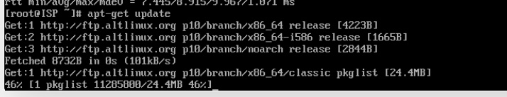

Установка пакета FRR - для работы маршрутизации - apt-get install frr

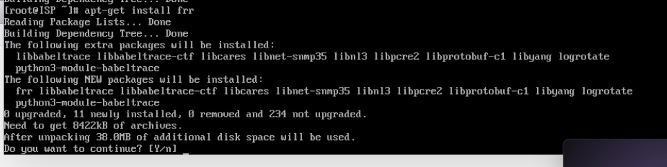


Добавляем сервис frr в автозагрузку - systemctl enable —now frr

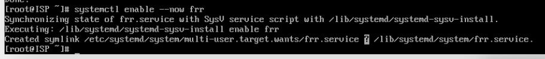

*Для проверки работы пакета - systemctl status

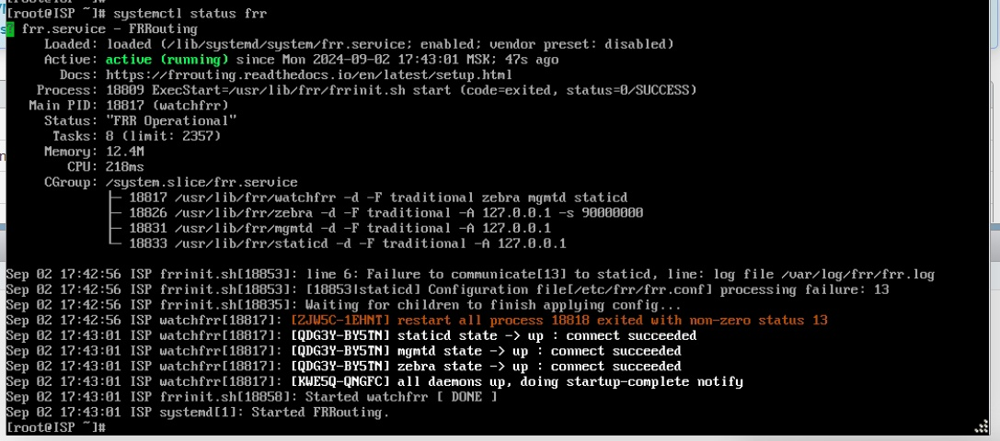

### Конфигурация frr

Включаем OSPF и EIGRP

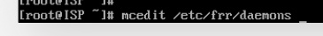

Ставим "yes" напротив ospfd и eigrpd - С МАЛЕНЬКОЙ БУКВЫ

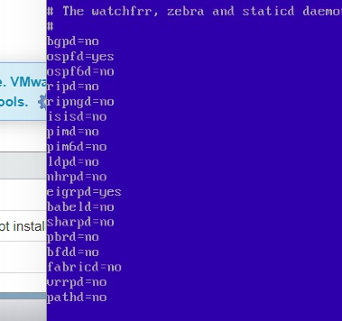

Перезапускаем сервис для применения настройки


Заходим в терминал frr

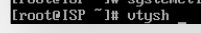

*работаем как в обычной Cisco IOS

en - режим просмотра

conf t - режим конфигурации

router eigrp 1 - объявляем новый вариант динамической маршрутизации

network .......... - сети смотрим в скрнах, где конфигурация.

network ..........

#### Конфигурация frr для ISP (ПИСАТЬ НА ИСПЕ, HQ-RTR И BR-RTR)


#### Конфигурация frr для HQ-RTR (10.10 УБИРАТЬ)


#### Конфигурация frr для BR-RTR (10.10 УБИРАТЬ)


#### Для проверки FRR

en

show ip eigrp topology - посмотреть "видимые" сети


Должно быть видно все сети с ISP, *ВАЖНО, СЕТИ ОБНОВЛЯЮТСЯ ДО 10 МИНУТ*

### Включаем IP Forwarding

mcedit /etc/net/sysctl.conf

Параметр net.ipv4.ip_forward=0 ставим на "1"

Затем пишем - sysctl -p

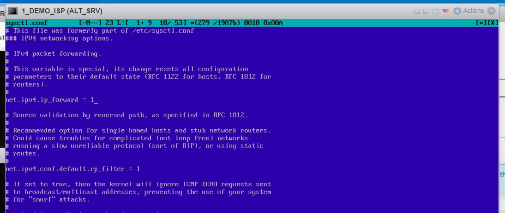

Затем пишем команду

sysctl net.ipv4.ip_forward=1

## 3. Создание локальных учетных записей

Создайте пользователя sshuser на серверах HQ-SRV и BR-SRV Пароль пользователя sshuser с паролем P@ssw0rd Идентификатор пользователя 1010 Пользователь sshuser должен иметь возможность запускать sudo без дополнительной аутентификации.

useradd - создание пользователя

Ключи к команде


Создаем пользователея с UID 1010

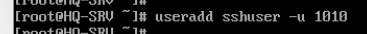

Изменяем пароль на пользователе (passwd sshuser)

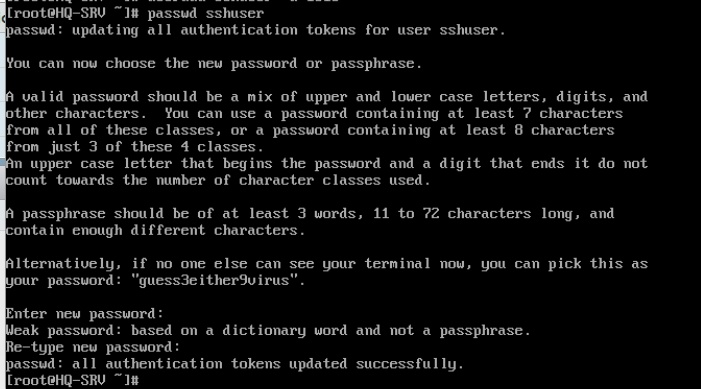

*Проверяем какие группы пользователей могут пользоваться sudo без авторизации


Добавляем пользователя sshuser в группу

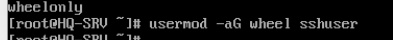

Проверяем что пользователь видится в двух группах

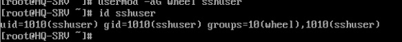

Даем пользователю права авторизации в sudo (root) без ввода пароля


Убираем комментарий с двух строчек

WHEEL_USERS ALL=(ALL:ALL) ALL

WHEEL_USERS ALL=(ALL;ALL) NOPASSWD: ALL

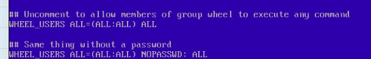

*Проверяем доступ к авторизации без пароля к пользователю sshuser

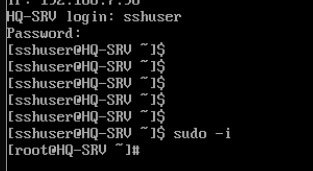

### Создайте пользователя net_admin на маршрутизаторах HQ-RTR и BR-RTR

Создаем пользователя

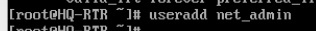

Изменяем пароль на P@$$word

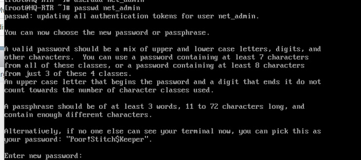

Добавляем пользователя в группу


Изменяем параметры прав


Убираем комментарий с двух строчек

WHEEL_USERS ALL=(ALL:ALL) ALL

WHEEL_USERS ALL=(ALL;ALL) NOPASSWD: ALL


## 4. Настройте на интерфейсе HQ-RTR в сторону офиса HQ виртуальный коммутатор: (пока на доработке, VLANы видит, отображает, но пинги не идут) *МОЖЕТ ЛУЧШЕ ЧЕРЕЗ openvswitch

Для настройки будем использовать виртуальные интерфейсы. Создаем директории для подинтерфейсов .10 и .20


Настраиваем IP-адрес для подинтерфейса .10


Настраиваем файл options для подинтерфейса .10


По заданию сервер HQ-SRV должен находиться в ID VLAN 100


Настраиваем IP-адрес для подинтерфейса .20


По заданию клиент HQ-CLI в ID VLAN 200 


### Создайте подсеть управления с ID VLAN 999


Скопируем файл options из .10


## 5. Настройка безопасного удаленного доступа на серверах HQ-SRV и BR-SRV:

apt-get update - обновляем репозитории

apt-get install openssh-server


*При установке, могут возникнуть ошибки с работой пакета, в таком случае пишем systemctl daemon-reload

Дополнительно повторно проводим команду установки пакета

Добавляем сервис в автозагрузку systemctl enable —now sshd


#### Настройка файла конфигурации OpenSSH


Открываем файл, находим атрибут #port 22 - изменяем его на "port 2024" # - убираем


##### Ограничьте количество попыток входа до двух - меняем параметр с "6" на "2"


##### Настройте баннер «Authorized access only». Находим #no default banner path

Изменяем строчку, добавляя путь к файлу с данными по баннеру


Создаем файл с баннером

mcedit /etc/32admsbanner

В него прописываем баннер по заданию


##### Разрешите подключения только пользователю sshuser

Добавляем строчку AllowUsers и пишем имя пользователя с доступом


После перезагружаем сервис systemctl restart sshd

*Проверяем работу с другого устройства (HQ-RTR)


## 6. Между офисами HQ и BR необходимо сконфигурировать ip туннель

## 7. Обеспечьте динамическую маршрутизацию: ресурсы одного офиса должны быть доступны из другого офиса. Для обеспечения динамической маршрутизации используйте link state протокол на ваше усмотрение

Выполнение работы с ISP идентично на frr на BR-RTR и HQ-RTR

В качестве link state протокола можем использовать OSPF или EIGRP, в примере предоставлен вариант настройки через протокол EIGRP.

Конфигурации в пункте 2 - https://github.com/ItsLiventsev/NetSys_Demo_2025?tab=readme-ov-file#%D0%BA%D0%BE%D0%BD%D1%84%D0%B8%D0%B3%D1%83%D1%80%D0%B0%D1%86%D0%B8%D1%8F-frr

## 8. Настройка динамической трансляции адресов.

## 9. Настройка протокола динамической конфигурации хостов.

Настройте нужную подсеть .Для офиса HQ в качестве сервера DHCP выступает маршрутизатор HQ-RTR. Клиентом является машина HQ-CLI. Исключите из выдачи адрес маршрутизатора. Адрес шлюза по умолчанию – адрес маршрутизатора HQ-RTR. Адрес DNS-сервера для машины HQ-CLI – адрес сервера HQ-SRV. DNS-суффикс для офисов HQ – au-team.irpo. Сведения о настройке протокола занесите в отчёт

DHCP — сетевой протокол, позволяющий сетевым устройствам автоматически получать IP-адрес и другие параметры, необходимые для работы в сети TCP/IP.

Устанавливаем пакет dhcp-server

apt-get install dhcp-server


Добавляем в автозагрузку


Копируем файл example, создаем "чистовик" dhcpd.conf - он будет использоваться в качесвте конфигуратора DHCP сервера


Открываем вновь созданный файл


Производим настройку*


*Некоторые общие параметры сервера DHCP:

subnet— Параметр объявляет подсеть (в нашем случае 192.168.38.0 с маской 255.255.255.0)

range  – Диапазон выдаваемых адресов

option subnet-mask – Маска сети.

option broadcast-address – Широковещательный адрес.

domain-name-servers – Адреса серверов DNS.

option domain-name  – Доменное имя.

option routers – Определяет IP-адрес вашего шлюза или точки выхода в сеть.

Чтобы задать время аренды по умолчанию и максимальное время аренды

default-lease-time 600;

max-lease-time 7200;

Для резервирования адреса добавляем строки "host"

host SERVER {
  hardware ethernet 08:60:6e:d6:5e:ff;
  fixed-address 192.168.38.5;}
}

Выставляем сетевой адаптер, который будет работать на раздачу DHCP


Сетевой адаптер в сторону сети HQ-NET


*Проверяем на CLI

IP-адрес был получен по DHCP с сервера


## 10. Настройка DNS для офисов HQ и BR.

## 11. Настройте часовой пояс на всех устройствах, согласно месту проведения экзамена.

По заданию просят только настроить часовой пояс на всех устройствах, менять время при этом не просят. Поэтому меняем пояс согласно месту проведения экзамена - Europe/Moscow


*если в задании поменяют регион на определенный, то посмотреть список регионов и городов можно тут


#### Пример заполнения таблицы адресов устройств


# Модуль 2 "Организация сетевого администрирования операционных систем"

## 1. Настройте доменный контроллер Samba на машине BR-SRV. Создайте 5 пользователей для офиса HQ: имена пользователей формата user№.hq. Создайте группу hq, введите в эту группу созданных пользователей. Введите в домен машину HQ-CLI. Пользователи группы hq имеют право аутентифицироваться на клиентском ПК. Пользователи группы hq должны иметь возможность повышать привилегии для выполнения ограниченного набора команд: cat, grep, id. Запускать другие команды с повышенными привилегиями пользователи группы не имеют права. Выполните импорт пользователей из файла users.csv. Файл будет располагаться на виртуальной машине BR-SRV в папке /opt (ДОЛГО И НУДНО, ПЛЮС ВЫ НИКОГДА НЕ УСПЕВАЕТЕ, ПОЭТОМУ ПОКА ПРОПУСКАМ)

## 2. Сконфигурируйте файловое хранилище: • При помощи трёх дополнительных дисков, размером 1Гб каждый, на HQ-SRV сконфигурируйте дисковый массив уровня 5 • Имя устройства – md0, конфигурация массива размещается в файле /etc/mdadm.conf • Обеспечьте автоматическое монтирование в папку /raid5 • Создайте раздел, отформатируйте раздел, в качестве файловой системы используйте ext4

### Добавляем виртуальные жесткие диски в ВМ HQ-SRV

Открываем настройки ВМ и добавляем три виртуальных диска по 1 гб каждый


### Работа с parted

*название разделов и название дисков может отличаться

Для работы с дисками используем утилиту - parted


Чтобы посмотреть "физические" (виртуальные) диски пишем print devices


ДИСК /dev/sda НЕ ТРОГАТЬ - ЭТО ДИСК С ОПЕРАЦИОННОЙ СИСТЕМОЙ

Диски sdb, sdc, sdd - наши вновь созданные виртуальные диски для создания RAID 5

#### *Немного теории по parted

Если нужно настроить конкретный диск, то его сначала надо выбрать - select *диск*


Для создания таблицы разделов используется команда mktable *тип таблицы*


Для вывода информации по определенному диску - после выбора диска используйте команду - print

Для создания нового раздела (логического диска) используем команду mkpart (в атрибутах можно указывать размеры в битах, мб или использовать проценты


### Работа с программным контроллером RAID. Создание RAID 5

*название разделов и название дисков может отличаться

Для конфигурации RAID используется утилита mdadm

Для создания RAID используем следующую команду:

mdadm --create --level=5 --raid-devices=3 /dev/md/md0 /dev/sdb /dev/sdc /dev/sdd


где:

--create - создать

--verbose - выводить подробную информацию при работе утилиты mdadm

/dev/md/md0 — имя блочного устройства RAID, которое появится после сборки массива

--level=5 — уровень RAID массива (1,2,5,10)

--raid-devices=3 — количество дисков, включаемых в массив

/dev/sdb /dev/sdc /dev/sdd — имена дисков, включаемых в массив

### Отформатируйте раздел, в качестве файловой системы используйте ext4

*название разделов и название дисков может отличаться


### Обеспечьте автоматическое монтирование в папку /raid5

Для конфигурации автоматического монтирования в систему - используется файл /etc/fstab


В файле необходимо создать новую запись, в котором указать атрибуты монтирования


где:

* filesystem. Физическое место размещения файловой системы, по которому определяется конкретный раздел или устройство хранения для монтирования. 

* dir. Точка монтирования, куда монтируется корень файловой системы. 
*type.  Тип файловой системы. Поддерживается множество типов. 

*options.  Параметры монтирования файловой системы. 

*dump.  Используется утилитой dump для определения того, нужно ли создать резервную копию данных в файловой системе. Возможные значения: 0 или 1. 

*pass. Используется программой fsck для определения того, нужно ли проверять целостность файловой системы. Возможные значения: 0, 1 или 2. 

### Настройте сервер сетевой файловой системы(nfs), в качестве папки общего доступа выберите /raid5/nfs, доступ для чтения и записи для всей сети в сторону HQ-CLI

Обновляем репозитории, устанавливаем пакет nfs-server


Добавляем nfs-server в автозагрузку


Создаем папку nfs на нашем RAID-массиве (обратите внимание, RAID должен быть монтирован в папку /raid5)


Производим конфигурацию NFS


/raid5/nfs 192.168.1.0/29(rw,subtree_check,no_root_squash)


#### На HQ-CLI настройте автомонтирование в папку /mnt/nfs (*ДОДЕЛАТЬ МОНТИРОВАНИЕ)

*Проверяем для теста соединения и монтирование папки вообще


Пробуем создать файлик


Видим, что файлик есть


Для автоматического монтирования на клиенте используем fstab (*ДОДЕЛАТЬ МОНТИРОВАНИЕ)

Добавляем новую запись


После перезагрузки, автомонтирование работает
##### Основные параметры сервера отметьте в отчёте

### 5. Развертывание приложений в Docker на сервере BR-SRV. (взято у @abdurrah1m🥲)

• Создайте в домашней директории пользователя файл wiki.yml для приложения MediaWiki.
• Средствами docker compose должен создаваться стек контейнеров с приложением MediaWiki и базой данных.
• Используйте два сервиса
• Основной контейнер MediaWiki должен называться wiki и использовать образ mediawiki
• Файл LocalSettings.php с корректными настройками должен находиться в домашней папке пользователя и автоматически монтироваться в образ.
• Контейнер с базой данных должен называться mariadb и использовать образ mariadb.
• Разверните
• Он должен создавать базу с названием mediawiki, доступную по стандартному порту, пользователя wiki с паролем WikiP@ssw0rd должен иметь права доступа к этой базе данных
• MediaWiki должна быть доступна извне через порт 8080.

Установка Docker и Docker-compose:
```
apt-get update && apt-get install -y docker-engine
apt-get install -y docker-compose
```
Автозагрузка `Docker`:
```
systemctl enable --now docker
```
Привязка пользователя к `Docker`:
```
usermod user -aG docker
```
Переходим к домашней директории пользователя:
```
cd /home/user
```
Создаём файл wiki.yml:
```
touch wiki.yml
```
```yml
version: '3'
services:
  wiki:
    image: mediawiki
    restart: always
    ports:
      - 8080:80
    links:
      - database
    container_name: wiki
    volumes:
      - images:/var/www/html/images
# Сначала устанавливаем вручную до конца, потом убираем комментарий
#      - ./LocalSettings.php:/var/www/html/LocalSettings.php
  database:
    image: mariadb
    container_name: mariadb
    restart: always
    environment:
      MYSQL_DATABASE: mediawiki
      MYSQL_USER: wiki
      MYSQL_PASSWORD: WikiP@ssw0rd
      MYSQL_RANDOM_ROOT_PASSWORD: 'yes'
      TZ: Asia/Yekaterinburg
    volumes:
      - db:/var/lib/mysql
volumes:
  images:
  db:
```
Запускаем контейнеры:
```
docker compose -f wiki.yml up -d
```
Переходим по `<ip-сервера>:8080` и должно появиться - 'Please set up the wiki first'


Для того, чтобы узнать хост базы данных:
```
docker exec -it mariadb bash
```
```
hostname -i
```
Вывод
```
172.18.0.2
```


Принимаем условия `Далее`


# Модуль 3 "Эксплуатация объектов сетевой инфраструктуры"

## Модуль 4 "Вариативная часть" (в разработке)

# Данные для авториации в виртуальных машинах стенда

| Тип операционной системы | Логин      |  Пароль         |
| :---------------------:  | :--------: | :-------------: | 
| Eltex                    | admin      | P@ssw0rd        | 
| ALT_SRV                  | root       | P@ssw0rd        | 
| ALT_CLI                  | user       | P@ssw0rd        | 
| ASTRA_CLI                | root       | P@ssw0rd        |
