## Стенд @pk8.mskobr по специальности 09.02.06 Сетевое и системное администрирование на 2024-2025 год

Базовый стенд представлен по сссылке - https://disk.yandex.ru/d/Qfry02DM_LYcGA (вложенный ахрив, открывать через 7-ZIP) (Стенд для добавления в VMware Player, вложенная виртуализация через ESXi). (в стенде могут быть изменения)

# Модуль 1 "Настройка сетевой инфраструктуры"

## Вводная информация по модулю 1

#### Топология сети

### Требования к ресурсам и гостевым ОС

### Таблица имен

## 1. Произведите базовую настройку устройств

Для базовой настройки ОС необходимо выдать имя хоста (hostname), IP-адреса на ВСЕ сетевые адаптеры, произвести обновление репозиториев, установить необходимые пакеты. (в задании указано IP-адрес должен быть из приватного диапазона, в случае, если сеть локальная, согласно RFC1918*)

### Выдача имени хоста (hostname)

mcedit /etc/hostname

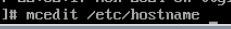

Изменяем данные в файле на имя машины по заданию

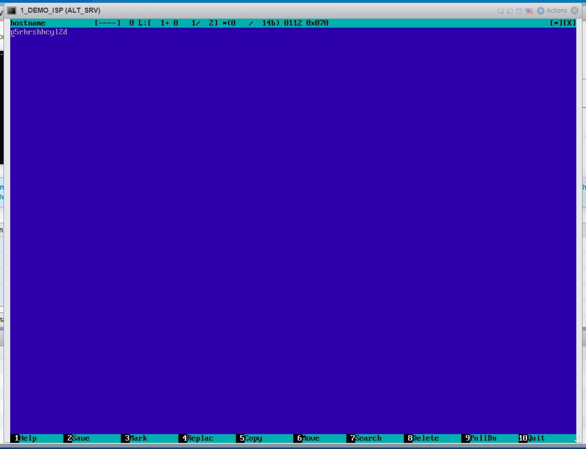

Сохраняем данные (Esc)

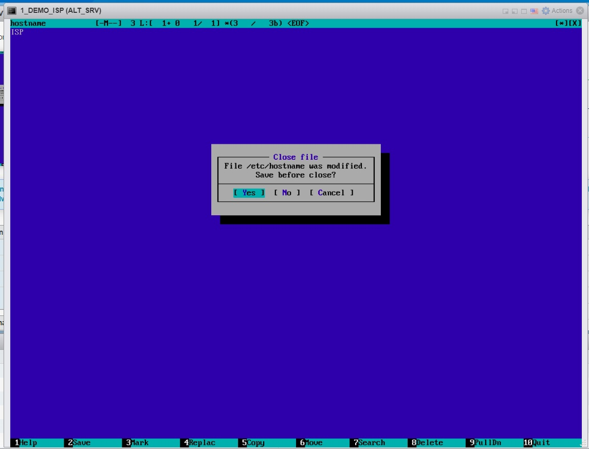

-------------------

### Настройка IP-адресов

Для проверки виртуальных сетевых адаптеров прописываем на ВМ команду - ip -c a

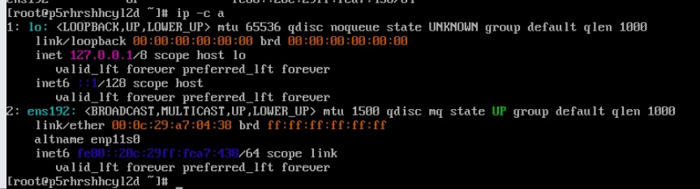

Если на ВМ не хватает сетевых адаптеров по схеме, то добавляем новые в настройках ВМ.

Правой кнопкой по окну ВМ или в списке ВМ и открываем Edit Setings

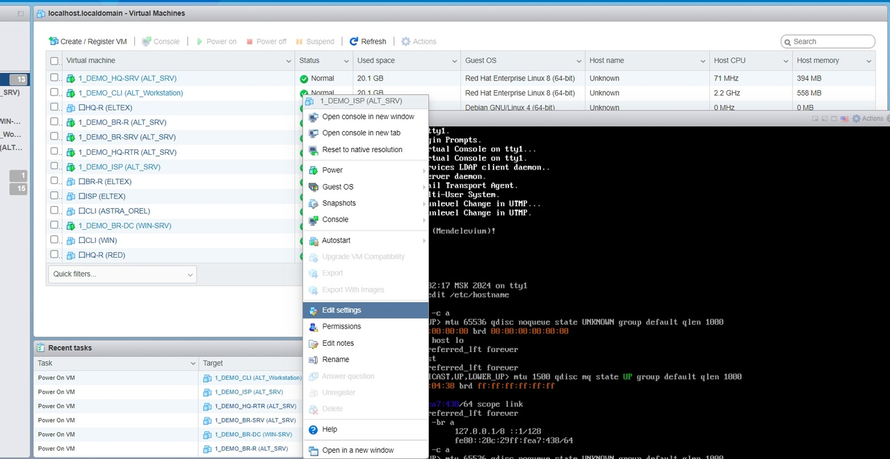

В меню выбираем Add network adapter

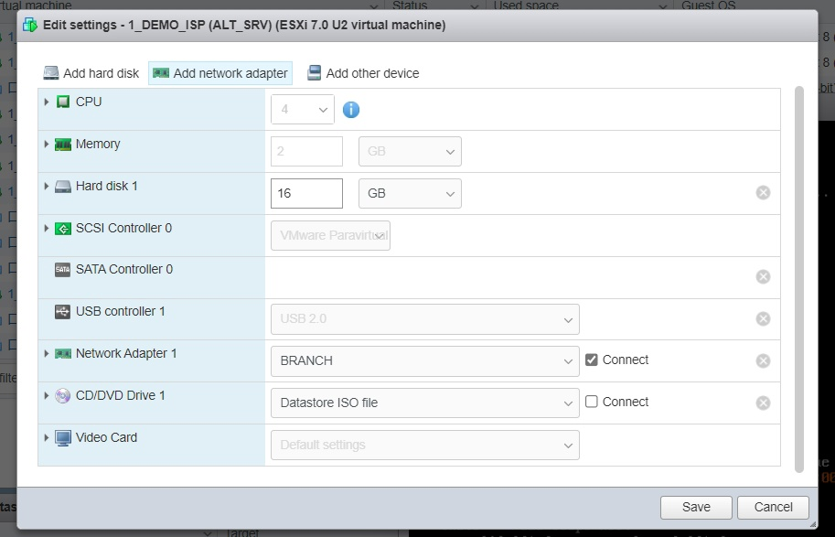

Далее проставляем сети в соответствии с заданием (схемой сети)

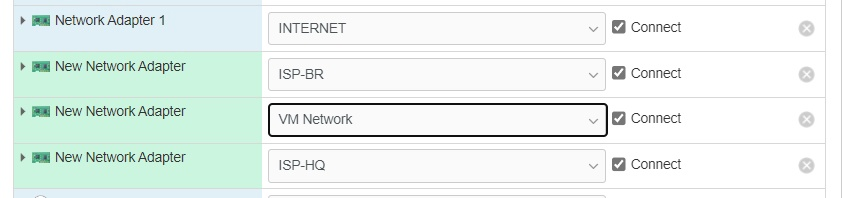

#### Корректные сетевые адаптеры для ISP

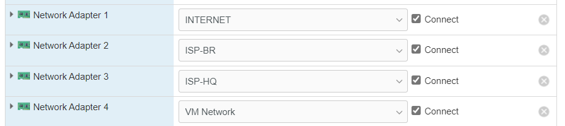

#### Корректные сетевые адаптеры для BR-RTR

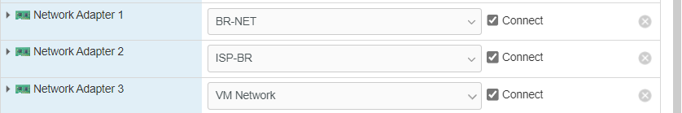

#### Корректные сетевые адаптеры для BR-SRV

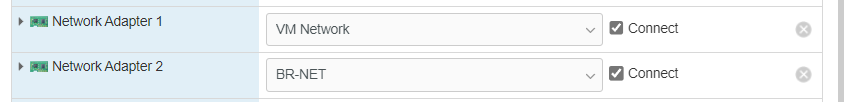

#### Корректные сетевые адаптеры для CLI

#### Корректные сетевые адаптеры для HQ-RTR

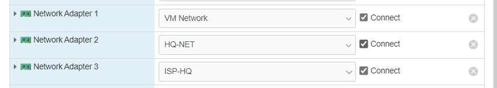

#### Корректные сетевые адаптеры для BR-DC

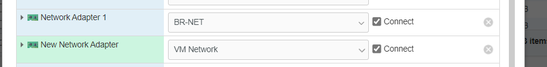

#### Корректные сетевые адаптеры для HQ-SRV

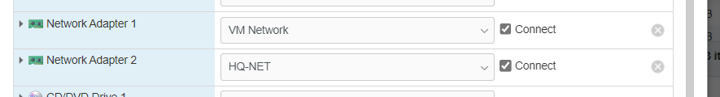

--------------------

*RFC1918 - меморандум Internet Engineering Task Force (IETF) о методах назначения частных IP-адресов в сетях TCP/IP.

| Блок адресов      | Макс.            |  Префиксы           |
| :-----------------| :--------:       | :-------------:     | 
| 10.0.0.0          | 10.255.255.255   | 10/8 prefix         | 
| 172.16.0.0        | 172.31.255.255   | 172.16/12 prefix    | 
| 192.168.0.0       | 192.168.255.255  | 192.168/16 prefix   |

#### Пример варианта IP-адресации (лучше также сделать в отдельно файлике у себя, чтобы не путаться)

#### Постановка адресации на ВМ без графического интерфейса

Создаем директории для новых адаптеров, по названию адаптеров*

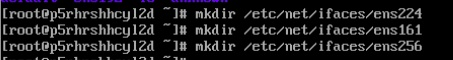

*названия адаптеров смотрим в ip -c a

**Директория для ens192 уже пресоздана на всех машинках

Копируем файл конфигурации сетевого адаптера ИЗ ENS192 в каждую директорию сетевого адаптера

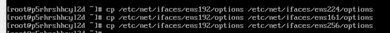

#### Выдача IP-адреса по DHCP

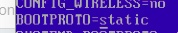

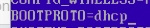

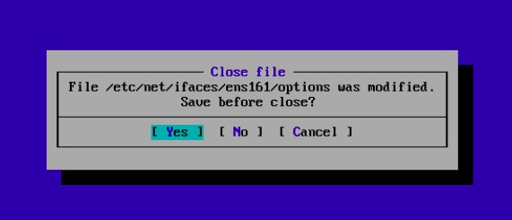

#### Выдача статических адресов

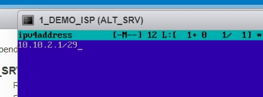

#### Настройка основного шлюза для статики

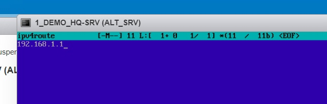

Чтобы обновить данные - перезапускаем сервис сети

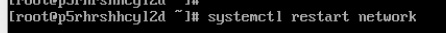

Видим по итогу, что сетевые адаптеры обновились и выдались адреса

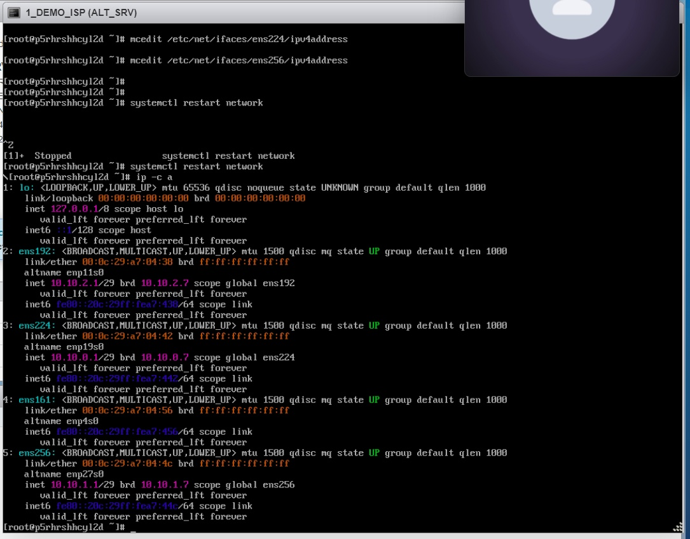

Для примеения имени хоста - перезагружаем ВМ

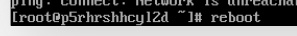

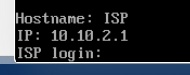

-------------------

#### Пример настройки для HQ-SRV

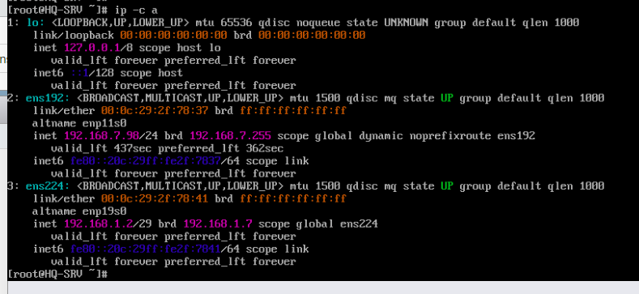

#### Пример настройки для BR-SRV

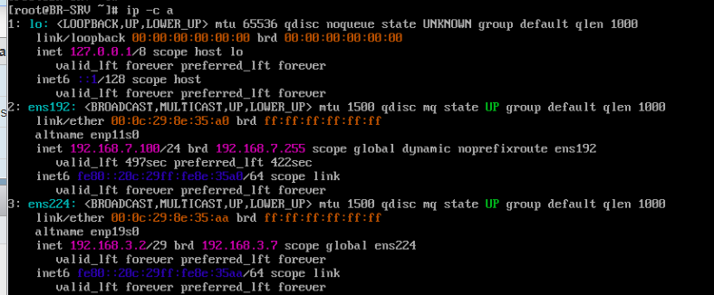

#### Пример настройки для HQ-RTR

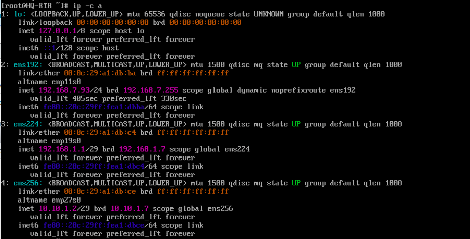

#### Пример настройки для CLI

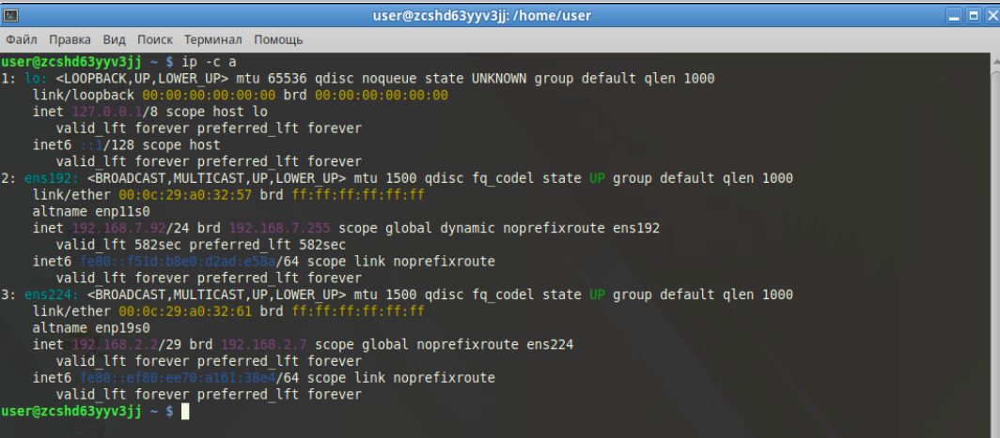

#### Пример настройки для BR-R

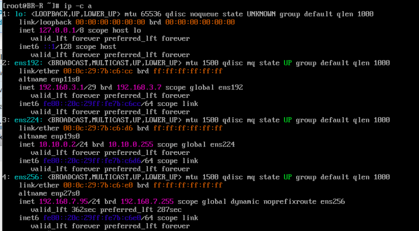

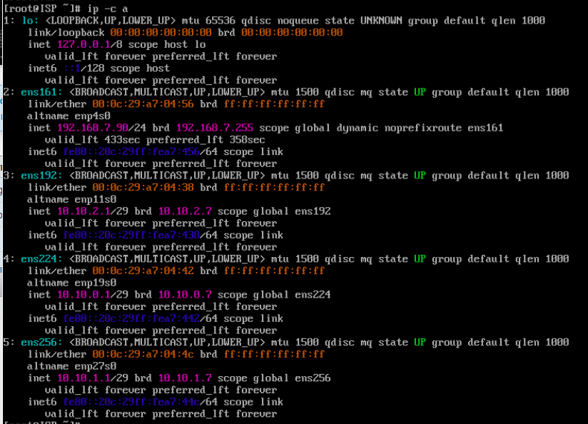

--------------------

## 2. Настройка ISP

Настройте адресацию на интерфейсах: Интерфейс, подключенный к магистральному провайдеру, 
получает адрес по DHCP Настройте маршруты по умолчанию там, где это необходимо Интерфейс, к которому подключен HQ-RTR, подключен к сети 
172.16.4.0/28 Интерфейс, к которому подключен BR-RTR, подключен к сети 
172.16.5.0/28 На ISP настройте динамическую сетевую трансляцию в сторону HQ-RTR и BR-RTR для доступа к сети Интернет

apt-get update - обновление баз данных репозиториев

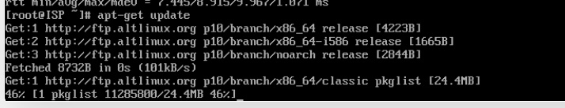

Установка пакета FRR - для работы маршрутизации - apt-get install frr

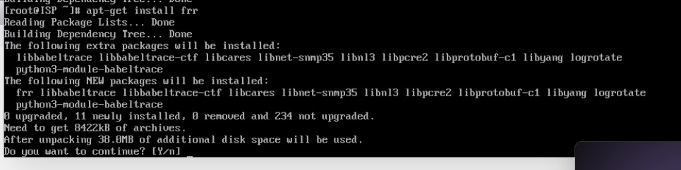

Добавляем сервис frr в автозагрузку - systemctl enable —now frr

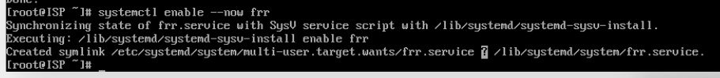

*Для проверки работы пакета - systemctl status

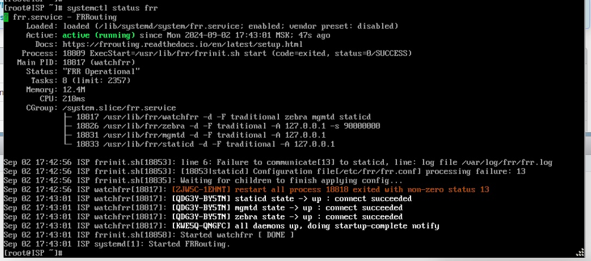

### Конфигурация frr

Включаем OSPF и EIGRP

Ставим "yes" напротив ospfd и eigrpd - С МАЛЕНЬКОЙ БУКВЫ

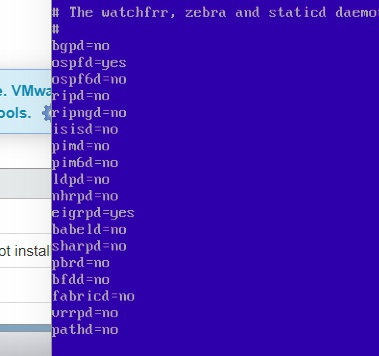

Перезапускаем сервис для применения настройки

Заходим в терминал frr

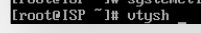

*работаем как в обычной Cisco IOS

#### Конфигурация frr для ISP

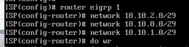

#### Конфигурация frr для HQ-RTR

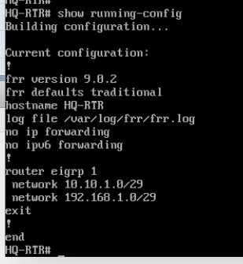

#### Конфигурация frr для BR-RTR

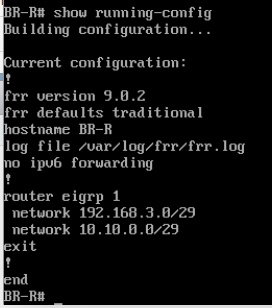

### Включаем IP Forwarding

mcedit /etc/net/sysctl.conf

Параметр net.ipv4.ip_forward=0 ставим на "1"

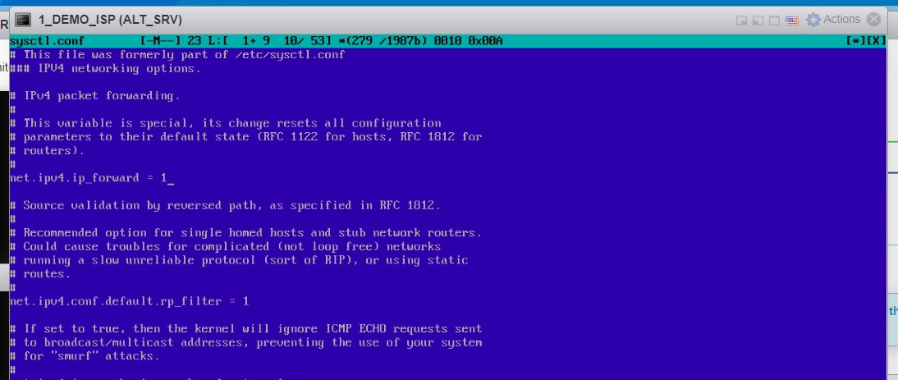

## 3. Создание локальных учетных записей

Создайте пользователя sshuser на серверах HQ-SRV и BR-SRV Пароль пользователя sshuser с паролем P@ssw0rd Идентификатор пользователя 1010 Пользователь sshuser должен иметь возможность запускать sudo без дополнительной аутентификации.

useradd - создание пользователя

Ключи к команде тут - https://edu-web.sferum.ru/doc709873984_680191273?hash=QEVZKP4LFyigZ1HPCNL1iOJ9D8rlzuxVD81zyXeBZ0X&dl=G4YDSOBXGM4TQNA%3A1725361377%3AwQXwRHJABAZB6lFf5UFyM5zhJQRdNUCKcEy7aPUVCac&from_module=vkmsg_desktop

Создаем пользователея с UID 1010

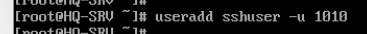

Изменяем пароль на пользователе (passwd sshuser)

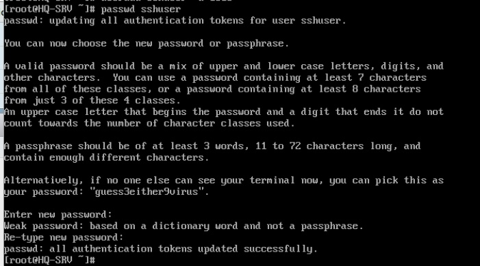

*Проверяем какие группы пользователей могут пользоваться sudo без авторизации

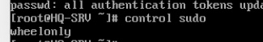

Добавляем пользователя sshuser в группу

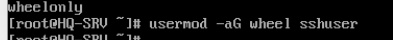

Проверяем что пользователь видится в двух группах

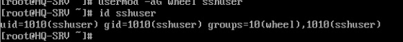

Даем пользователю права авторизации в sudo (root) без ввода пароля

Убираем комментарий с двух строчек

WHEEL_USERS ALL=(ALL:ALL) ALL

WHEEL_USERS ALL=(ALL;ALL) NOPASSWD: ALL

*Проверяем доступ к авторизации без пароля к пользователю sshuser

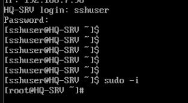

### Создайте пользователя net_admin на маршрутизаторах HQ-RTR и BR-RTR

Создаем пользователя

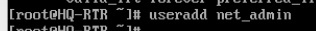

Изменяем пароль на P@$$word

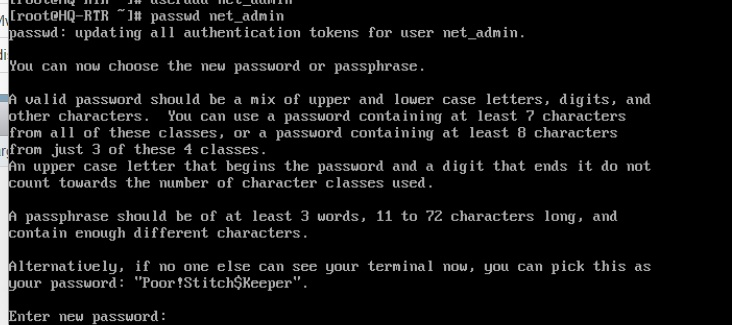

Добавляем пользователя в группу

Изменяем параметры прав

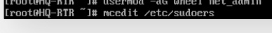

Убираем комментарий с двух строчек

WHEEL_USERS ALL=(ALL:ALL) ALL

WHEEL_USERS ALL=(ALL;ALL) NOPASSWD: ALL

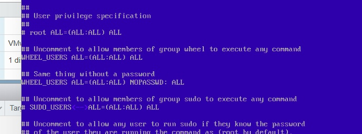

## 4. Настройте на интерфейсе HQ-RTR в сторону офиса HQ виртуальный коммутатор: (пока на доработке, VLANы видит, отображает, но пинги не идут) *МОЖЕТ ЛУЧШЕ ЧЕРЕЗ openvswitch

Для настройки будем использовать виртуальные интерфейсы. Создаем директории для подинтерфейсов .10 и .20

Настраиваем IP-адрес для подинтерфейса .10

Настраиваем файл options для подинтерфейса .10

По заданию сервер HQ-SRV должен находиться в ID VLAN 100

Настраиваем IP-адрес для подинтерфейса .20

По заданию клиент HQ-CLI в ID VLAN 200 

### Создайте подсеть управления с ID VLAN 999

Скопируем файл options из .10

## 5. Настройка безопасного удаленного доступа на серверах HQ-SRV и BR-SRV:

apt-get update - обновляем репозитории

apt-get install openssh-server

*При установке, могут возникнуть ошибки с работой пакета, в таком случае пишем systemctl daemon-reload

Дополнительно повторно проводим команду установки пакета

Добавляем сервис в автозагрузку systemctl enable —now sshd

#### Настройка файла конфигурации OpenSSH

Открываем файл, находим атрибут #port 22 - изменяем его на "port 2024" # - убираем

##### Ограничьте количество попыток входа до двух - меняем параметр с "6" на "2"

##### Настройте баннер «Authorized access only». Находим #no default banner path

Изменяем строчку, добавляя путь к файлу с данными по баннеру

Создаем файл с баннером

mcedit /etc/32admsbanner

В него прописываем баннер по заданию

##### Разрешите подключения только пользователю sshuser

Добавляем строчку AllowUsers и пишем имя пользователя с доступом

После перезагружаем сервис systemctl restart sshd

*Проверяем работу с другого устройства (HQ-RTR)

## 6. Между офисами HQ и BR необходимо сконфигурировать ip туннель

## 7. Обеспечьте динамическую маршрутизацию: ресурсы одного офиса должны быть доступны из другого офиса. Для обеспечения динамической маршрутизации используйте link state протокол на ваше усмотрение

Выполнение работы с ISP идентично на frr на BR-RTR и HQ-RTR

В качестве link state протокола можем использовать OSPF или EIGRP, в примере предоставлен вариант настройки через протокол EIGRP.

Конфигурации в пункте 2 - https://github.com/ItsLiventsev/NetSys_Demo_2025?tab=readme-ov-file#%D0%BA%D0%BE%D0%BD%D1%84%D0%B8%D0%B3%D1%83%D1%80%D0%B0%D1%86%D0%B8%D1%8F-frr

## 8. Настройка динамической трансляции адресов.

## 9. Настройка протокола динамической конфигурации хостов.

Настройте нужную подсеть .Для офиса HQ в качестве сервера DHCP выступает маршрутизатор HQ-RTR. Клиентом является машина HQ-CLI. Исключите из выдачи адрес маршрутизатора. Адрес шлюза по умолчанию – адрес маршрутизатора HQ-RTR. Адрес DNS-сервера для машины HQ-CLI – адрес сервера HQ-SRV. DNS-суффикс для офисов HQ – au-team.irpo. Сведения о настройке протокола занесите в отчёт

DHCP — сетевой протокол, позволяющий сетевым устройствам автоматически получать IP-адрес и другие параметры, необходимые для работы в сети TCP/IP.

Устанавливаем пакет dhcp-server

apt-get install dhcp-server

Добавляем в автозагрузку

Копируем файл example, создаем "чистовик" dhcpd.conf - он будет использоваться в качесвте конфигуратора DHCP сервера

Открываем вновь созданный файл

Производим настройку*

*Некоторые общие параметры сервера DHCP:

subnet— Параметр объявляет подсеть (в нашем случае 192.168.38.0 с маской 255.255.255.0)

range  – Диапазон выдаваемых адресов

option subnet-mask – Маска сети.

option broadcast-address – Широковещательный адрес.

domain-name-servers – Адреса серверов DNS.

option domain-name  – Доменное имя.

option routers – Определяет IP-адрес вашего шлюза или точки выхода в сеть.

Чтобы задать время аренды по умолчанию и максимальное время аренды

default-lease-time 600;

max-lease-time 7200;

Для резервирования адреса добавляем строки "host"

host SERVER {
  hardware ethernet 08:60:6e:d6:5e:ff;
  fixed-address 192.168.38.5;}
}

Выставляем сетевой адаптер, который будет работать на раздачу DHCP

Сетевой адаптер в сторону сети HQ-NET

*Проверяем на CLI

IP-адрес был получен по DHCP с сервера

## 10. Настройка DNS для офисов HQ и BR.

## 11. Настройте часовой пояс на всех устройствах, согласно месту проведения экзамена.

По заданию просят только настроить часовой пояс на всех устройствах, менять время при этом не просят. Поэтому меняем пояс согласно месту проведения экзамена - Europe/Moscow

*если в задании поменяют регион на определенный, то посмотреть список регионов и городов можно тут

#### Пример заполнения таблицы адресов устройств

# Модуль 2 "Организация сетевого администрирования операционных систем"

# Модуль 3 "Эксплуатация объектов сетевой инфраструктуры"

## Модуль 4 "Вариативная часть" (в разработке)

# Данные для авториации в виртуальных машинах стенда

| Тип операционной системы | Логин      |  Пароль         |
| :---------------------:  | :--------: | :-------------: | 
| Eltex                    | admin      | P@ssw0rd        | 
| ALT_SRV                  | root       | P@ssw0rd        | 
| ALT_CLI                  | user       | P@ssw0rd        | 
| ASTRA_CLI                | root       | P@ssw0rd        |
