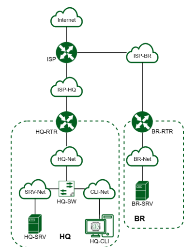
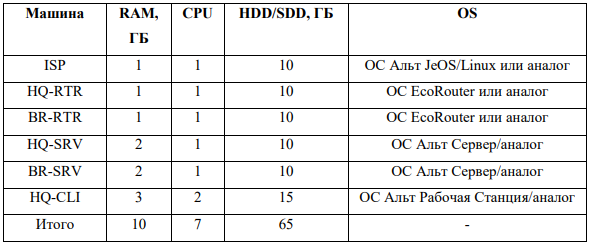
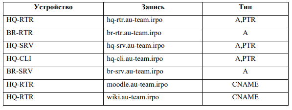
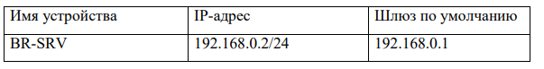

## Стенд @pk8.mskobr по специальности 09.02.06 Сетевое и системное администрирование на 2024-2025 год

Базовый стенд представлен по сссылке - https://disk.yandex.ru/d/Qfry02DM_LYcGA (вложенный ахрив, открывать через 7-ZIP) (Стенд для добавления в VMware Player, вложенная виртуализация через ESXi). (в стенде могут быть изменения)

# Модуль 1 "Настройка сетевой инфраструктуры"

## Вводная информация по модулю 1

#### Топология сети

### Требования к ресурсам и гостевым ОС

### Таблица имен

## 1. Произведите базовую настройку устройств

Для базовой настройки ОС необходимо выдать имя хоста (hostnmae), IP-адреса на ВСЕ сетевые адаптеры, произвести обновление репозиториев, установить необходимые пакеты. (в задании указано IP-адрес должен быть из приватного диапазона, в случае, если сеть локальная, согласно RFC1918*)
-------------------
*RFC1918 - меморандум Internet Engineering Task Force (IETF) о методах назначения частных IP-адресов в сетях TCP/IP.

| Блок адресов      | Макс.            |  Префиксы           |
| :-----------------| :--------:       | :-------------:     | 
| 10.0.0.0          | 10.255.255.255   | 10/8 prefix         | 
| 172.16.0.0        | 172.31.255.255   | 172.16/12 prefix    | 
| 192.168.0.0       | 192.168.255.255  | 192.168/16 prefix   |
--------------------
## 2. Настройка ISP

## 3. Создание локальных учетных записей

## 4. Настройте на интерфейсе HQ-RTR в сторону офиса HQ виртуальный коммутатор:

## 5. Настройка безопасного удаленного доступа на серверах HQ-SRV и BR-SRV:

## 6. Между офисами HQ и BR необходимо сконфигурировать ip туннель

## 7. Обеспечьте динамическую маршрутизацию: ресурсы одного офиса должны быть доступны из другого офиса. Для обеспечения динамической маршрутизации используйте link state протокол на ваше усмотрение

## 8. Настройка динамической трансляции адресов.

## 9. Настройка протокола динамической конфигурации хостов.

## 10. Настройка DNS для офисов HQ и BR.

## 11. Настройте часовой пояс на всех устройствах, согласно месту проведения экзамена.

#### Пример заполнения таблицы адресов устройств

# Модуль 2 "Организация сетевого администрирования операционных систем"

# Модуль 3 "Эксплуатация объектов сетевой инфраструктуры"

## Модуль 4 "Вариативная часть" (в разработке)

# Данные для авториации в виртуальных машинах стенда

| Тип операционной системы | Логин      |  Пароль         |
| :---------------------:  | :--------: | :-------------: | 
| Eltex                    | admin      | P@ssw0rd        | 
| ALT_SRV                  | root       | P@ssw0rd        | 
| ALT_CLI                  | user       | P@ssw0rd        | 
| ASTRA_CLI                | root       | P@ssw0rd        |