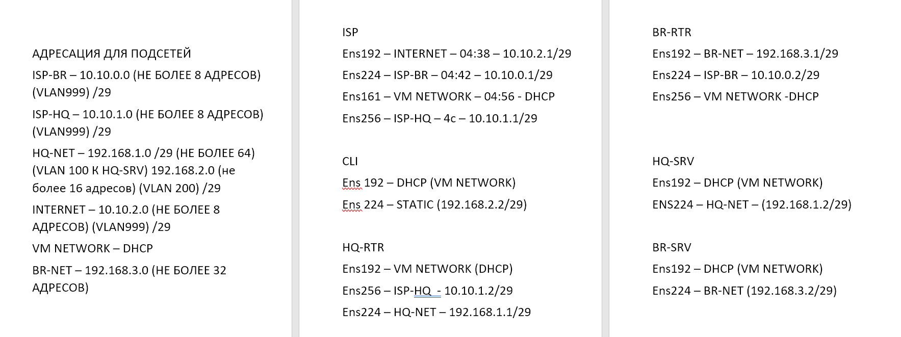

## Стенд @pk8.mskobr по специальности 09.02.06 Сетевое и системное администрирование на 2024-2025 год

Базовый стенд представлен по сссылке - https://disk.yandex.ru/d/Qfry02DM_LYcGA (вложенный ахрив, открывать через 7-ZIP) (Стенд для добавления в VMware Player, вложенная виртуализация через ESXi). (в стенде могут быть изменения)

# Модуль 1 "Настройка сетевой инфраструктуры"

## Вводная информация по модулю 1

#### Топология сети

### Требования к ресурсам и гостевым ОС

### Таблица имен

## 1. Произведите базовую настройку устройств

Для базовой настройки ОС необходимо выдать имя хоста (hostname), IP-адреса на ВСЕ сетевые адаптеры, произвести обновление репозиториев, установить необходимые пакеты. (в задании указано IP-адрес должен быть из приватного диапазона, в случае, если сеть локальная, согласно RFC1918*)

### Выдача имени хоста (hostname)

mcedit /etc/hostname

Изменяем данные в файле на имя машины по заданию

Сохраняем данные (Esc)

-------------------

### Настройка IP-адресов

Для проверки виртуальных сетевых адаптеров прописываем на ВМ команду - ip -c a

Если на ВМ не хватает сетевых адаптеров по схеме, то добавляем новые в настройках ВМ.

Правой кнопкой по окну ВМ или в списке ВМ и открываем Edit Setings

В меню выбираем Add network adapter

Далее проставляем сети в соответствии с заданием (схемой сети)

#### Корректные сетевые адаптеры для ISP

#### Корректные сетевые адаптеры для BR-RTR

#### Корректные сетевые адаптеры для BR-SRV

#### Корректные сетевые адаптеры для CLI

#### Корректные сетевые адаптеры для HQ-RTR

#### Корректные сетевые адаптеры для BR-DC

#### Корректные сетевые адаптеры для HQ-SRV

--------------------

*RFC1918 - меморандум Internet Engineering Task Force (IETF) о методах назначения частных IP-адресов в сетях TCP/IP.

| Блок адресов      | Макс.            |  Префиксы           |
| :-----------------| :--------:       | :-------------:     | 
| 10.0.0.0          | 10.255.255.255   | 10/8 prefix         | 
| 172.16.0.0        | 172.31.255.255   | 172.16/12 prefix    | 
| 192.168.0.0       | 192.168.255.255  | 192.168/16 prefix   |

#### Пример варианта IP-адресации (лучше также сделать в отдельно файлике у себя, чтобы не путаться)

#### Постановка адресации на ВМ без графического интерфейса

Создаем директории для новых адаптеров, по названию адаптеров*

*названия адаптеров смотрим в ip -c a

**Директория для ens192 уже пресоздана на всех машинках

Копируем файл конфигурации сетевого адаптера ИЗ ENS192 в каждую директорию сетевого адаптера

#### Выдача IP-адреса по DHCP

#### Выдача статических адресов

#### Настройка основного шлюза для статики

Чтобы обновить данные - перезапускаем сервис сети

Видим по итогу, что сетевые адаптеры обновились и выдались адреса

Для примеения имени хоста - перезагружаем ВМ

-------------------

#### Пример настройки для HQ-SRV

#### Пример настройки для BR-SRV

#### Пример настройки для HQ-RTR

#### Пример настройки для CLI

#### Пример настройки для BR-R

--------------------

## 2. Настройка ISP

Настройте адресацию на интерфейсах: Интерфейс, подключенный к магистральному провайдеру, 
получает адрес по DHCP Настройте маршруты по умолчанию там, где это необходимо Интерфейс, к которому подключен HQ-RTR, подключен к сети 
172.16.4.0/28 Интерфейс, к которому подключен BR-RTR, подключен к сети 
172.16.5.0/28 На ISP настройте динамическую сетевую трансляцию в сторону HQ-RTR и BR-RTR для доступа к сети Интернет

apt-get update - обновление баз данных репозиториев

Установка пакета FRR - для работы маршрутизации - apt-get install frr

Добавляем сервис frr в автозагрузку - systemctl enable —now frr

*Для проверки работы пакета - systemctl status

### Конфигурация frr

Включаем OSPF и EIGRP

Ставим "yes" напротив ospfd и eigrpd - С МАЛЕНЬКОЙ БУКВЫ

Перезапускаем сервис для применения настройки

Заходим в терминал frr

*работаем как в обычной Cisco IOS

#### Конфигурация frr для ISP

#### Конфигурация frr для HQ-RTR

#### Конфигурация frr для BR-RTR

### Включаем IP Forwarding

mcedit /etc/net/sysctl.conf

Параметр net.ipv4.ip_forward=0 ставим на "1"

## 3. Создание локальных учетных записей

Создайте пользователя sshuser на серверах HQ-SRV и BR-SRV Пароль пользователя sshuser с паролем P@ssw0rd Идентификатор пользователя 1010 Пользователь sshuser должен иметь возможность запускать sudo без дополнительной аутентификации.

useradd - создание пользователя

Ключи к команде тут - https://edu-web.sferum.ru/doc709873984_680191273?hash=QEVZKP4LFyigZ1HPCNL1iOJ9D8rlzuxVD81zyXeBZ0X&dl=G4YDSOBXGM4TQNA%3A1725361377%3AwQXwRHJABAZB6lFf5UFyM5zhJQRdNUCKcEy7aPUVCac&from_module=vkmsg_desktop

Создаем пользователея с UID 1010

Изменяем пароль на пользователе (passwd sshuser)

*Проверяем какие группы пользователей могут пользоваться sudo без авторизации

Добавляем пользователя sshuser в группу

Проверяем что пользователь видится в двух группах

Даем пользователю права авторизации в sudo (root) без ввода пароля

Убираем комментарий с двух строчек

WHEEL_USERS ALL=(ALL:ALL) ALL

WHEEL_USERS ALL=(ALL;ALL) NOPASSWD: ALL

*Проверяем доступ к авторизации без пароля к пользователю sshuser

### Создайте пользователя net_admin на маршрутизаторах HQ-RTR и BR-RTR

Создаем пользователя

Изменяем пароль на P@$$word

Добавляем пользователя в группу

Изменяем параметры прав

Убираем комментарий с двух строчек

WHEEL_USERS ALL=(ALL:ALL) ALL

WHEEL_USERS ALL=(ALL;ALL) NOPASSWD: ALL

## 4. Настройте на интерфейсе HQ-RTR в сторону офиса HQ виртуальный коммутатор:

apt-get update - обновляем репозитории

apt-get install openssh-server

*При установке, могут возникнуть ошибки с работой пакета, в таком случае пишем systemctl daemon-reload

Дополнительно повторно проводим команду установки пакета

Добавляем сервис в автозагрузку systemctl enable —now sshd

#### Настройка файла конфигурации OpenSSH

Открываем файл, находим атрибут #port 22 - изменяем его на "port 2024" # - убираем

##### Ограничьте количество попыток входа до двух - меняем параметр с "6" на "2"

##### Настройте баннер «Authorized access only». Находим #no default banner path

Изменяем строчку, добавляя путь к файлу с данными по баннеру

Создаем файл с баннером

mcedit /etc/32admsbanner

В него прописываем баннер по заданию

##### Разрешите подключения только пользователю sshuser

Добавляем строчку AllowUsers и пишем имя пользователя с доступом

После перезагружаем сервис systemctl restart sshd

*Проверяем работу с другого устройства (HQ-RTR)

## 5. Настройка безопасного удаленного доступа на серверах HQ-SRV и BR-SRV:

## 6. Между офисами HQ и BR необходимо сконфигурировать ip туннель

## 7. Обеспечьте динамическую маршрутизацию: ресурсы одного офиса должны быть доступны из другого офиса. Для обеспечения динамической маршрутизации используйте link state протокол на ваше усмотрение

## 8. Настройка динамической трансляции адресов.

## 9. Настройка протокола динамической конфигурации хостов.

## 10. Настройка DNS для офисов HQ и BR.

## 11. Настройте часовой пояс на всех устройствах, согласно месту проведения экзамена.

#### Пример заполнения таблицы адресов устройств

# Модуль 2 "Организация сетевого администрирования операционных систем"

# Модуль 3 "Эксплуатация объектов сетевой инфраструктуры"

## Модуль 4 "Вариативная часть" (в разработке)

# Данные для авториации в виртуальных машинах стенда

| Тип операционной системы | Логин      |  Пароль         |
| :---------------------:  | :--------: | :-------------: | 
| Eltex                    | admin      | P@ssw0rd        | 
| ALT_SRV                  | root       | P@ssw0rd        | 
| ALT_CLI                  | user       | P@ssw0rd        | 
| ASTRA_CLI                | root       | P@ssw0rd        |